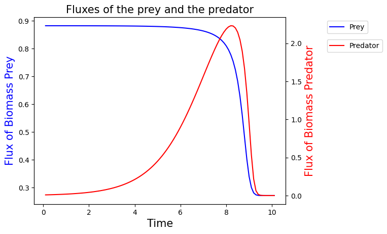
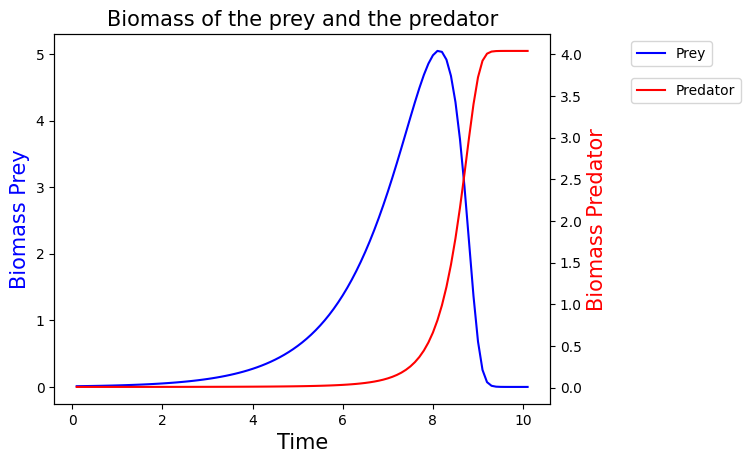
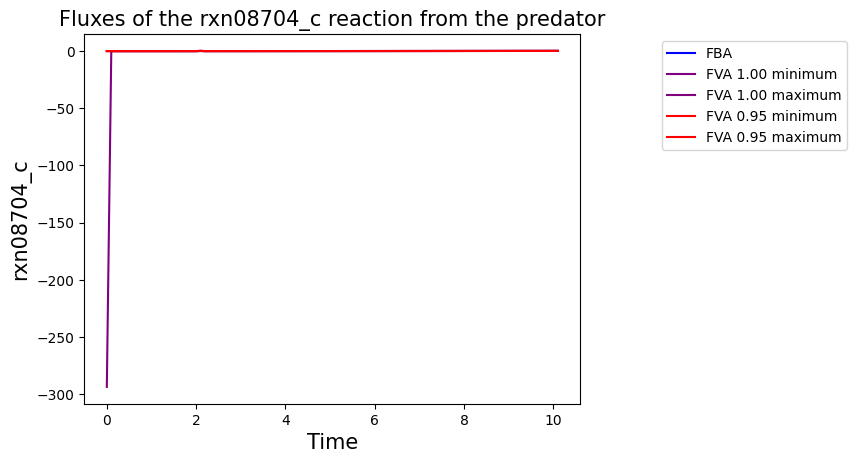
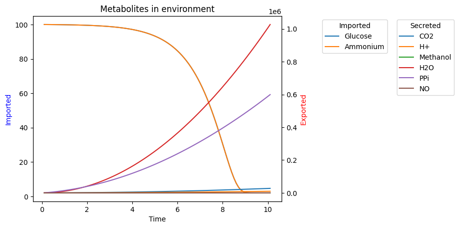

# M2 Internship Repository

- [1. Intership Works](#1-intership-works)
  - [1.1. Creating the predation model](#11-creating-the-predation-model)
  - [1.2. Looking at the difference between predation and alone - Python](#12-looking-at-the-difference-between-predation-and-alone---python)
  - [1.3. Looking at the difference between predation and alone - R](#13-looking-at-the-difference-between-predation-and-alone---r)
  - [1.4. Side Quest](#14-side-quest)
  - [1.5. Non Conluent Test](#15-non-conluent-test)
- [2. Predation Model](#2-predation-model)
  - [2.1. Setup](#21-setup)
  - [2.2. Predation](#22-predation)
  - [2.3. Plot](#23-plot)

## 1 Intership Works

### 1.1 Creating the predation model
- Create Dynamic environment
- Make reaction for predation
- Add plot for Biomass, Flux of Biomass and FVA flux for choosen reaction
- Add Fatty Acid importation: Palmitate and Myristic Acid

### 1.2 Looking at the difference between predation and alone - Python
- Try iMAT
- Use FBA Comparer
    - Most affected pathway
    - Most affected reaction
    - Flux Correlation Network

### 1.3 Looking at the difference between predation and alone - R
- DESeq2
- ShinyGO

### 1.4 Side Quest
- Create Genetic Algorithm

### 1.5 Non Conluent Test
- Essentiality Combination

## 2 Predation Model

This model aims to recreate the dynamic of predation using metabolic modelling, it has been made on python version 1.12.12

### 2.1 Setup
- Import necessary package.

```shell
import os
import numpy as np
import matplotlib.pyplot as plt
import pandas as pd
import cobra
from cobra.io import read_sbml_model, write_sbml_model
from cobra.flux_analysis import flux_variability_analysis
from tqdm import tqdm
```

- Import the model for: Predator and Prey
- Set up a dictionnary for the environment with full name metabolites with the first letter in capital and the quantity

```shell
prey = read_sbml_model("prey.xml")
pred = read_sbml_model("pred.xml")
env = {"Glucose": 1000, "Ammonium": 1000}
```

### 2.2 Predation
- Call the predation model giving him his parameter:
    - prey: model from the prey
    - pred: model from the predator
    - metabolite: environment dictionnaty
    - tf: final time
    - dt: number of steps

```shell
Preda = Predation(prey, pred, env, tf=10)
```

### 2.3 Plot
- Classical plot:
    - Flux
    ```shell
    Preda.plot_flux()
    ```

    
    - Biomass
    ```shell
    Preda.plot_biomass()
    ```

    

- FVA: Give from wich model and which reaction
    - Model: the model you want: Pred, pred, Predator, predator, Prey, prey
    - R: reaction wanted. Should be in the model !
```shell
Preda.plot_FVA(Model="Pred", R="rxn08704_c")
```



- Environment: plot the metabolites of the environment through time, you can look either to imported and / or secreted
    - imported: True or False, should be the imported metabolites. True by default
    - secreted: True or False, should be the secreted metabolites. False by default
```shell
Preda.plot_env() #only imported
Preda.plot_env(imported=False, secreted=True) #only secreted
Preda.plot_env(secreted=True) #both
```

